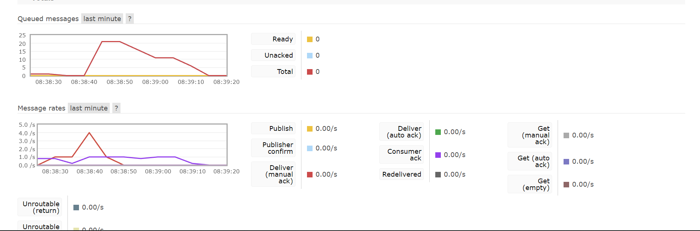
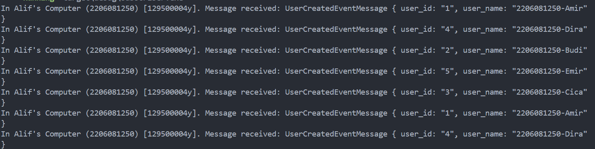
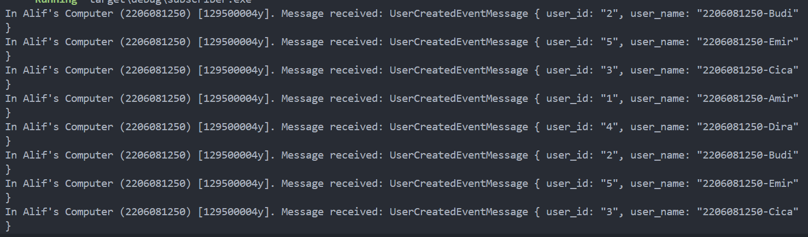
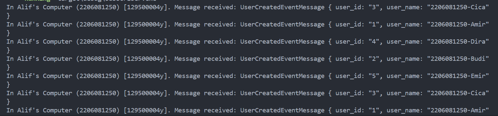
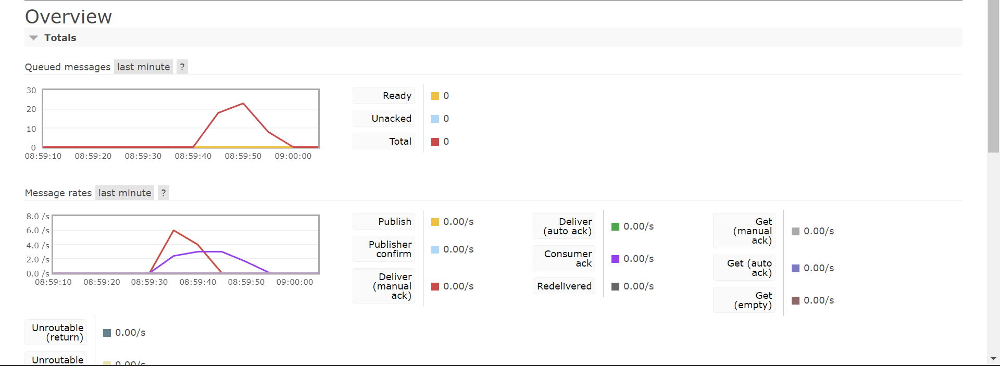

# Tutorial 8 Subscriber

**a. what is amqp?**

AMQP adalah singkatan dari Advanced Message Queuing Protocol. Ini merupakan sebuah open standard application layer protocol untuk message-oriented middleware. AMQP berguna untuk membantu komunikasi pesan dari berbagai komponen software yang berbeda. AMQP membantu publisher untuk berkomunikasi dengan client, dimana data atau pesan akan dikirimkan ke middleware ini dan client akan mendapatkan data atau pesan dari middleware tersebut.

**b. what it means? guest:guest@localhost:5672 , what is the first quest, and what is
the second guest, and what is localhost:5672 is for?**

`guest:guest` merupakan username dan password yang digunakan untuk autentikasi saat akan terhubung dengan server. Pada kasus ini username dan passwordnya adalah guest. Sementara itu, `localhost` merujuk pada hostname dari server yang sedang berjalan. Dimana `localhost` berarti server berjalan di server yang sama dengan perangkat yang digunakan sekarang. Dan `:567` merupakan port number yang digunakan server.

**Simulation slow subscriber**

Pada gambar diatas terlihat bahwa, pada suatu waktu, terdapat 20 message pada queue. Hal ini terjadi karena subscriber memerlukan waktu yang lama untuk mengelola tiap event atau pesan dibandingkan publisher mengirim event atau pesan sehingga terjadi penumpukan message.

Subscriber - 1

Subscriber - 2

Subscriber - 3

Pada gambar diatas terlihat bahwa setiap subscriber memproses event yang berbeda secara bersamaan. Subscriber pertama akan memproses pesan user id 1, subscriber kedua 2 akan memproses pesan user id 2, dan subscriber ketiga akan memproses pesan user id 3. Dan begitu seterusnya.

Terlihat bahwa message queue berkurang lebih cepat dibandingka sebelumnya. Hal ini dikarenakan sekarang pesan atau event tersebut telah diproses oleh lebih banyak subscriber sehingga tidak terjadi penumpukan seburuk sebelumnya.
